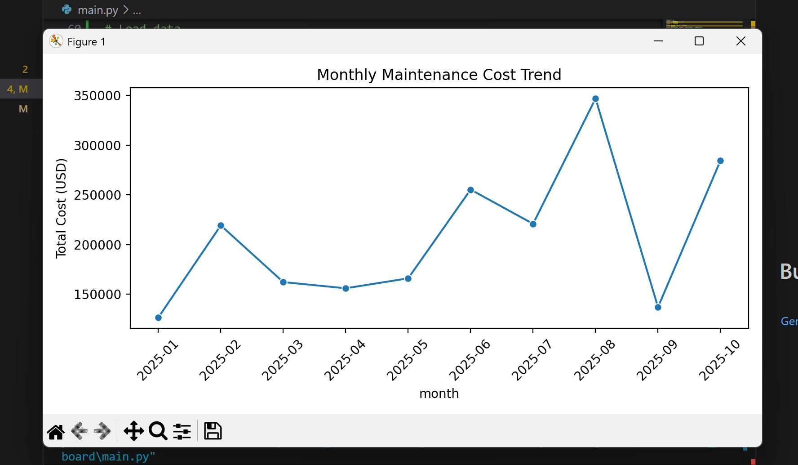
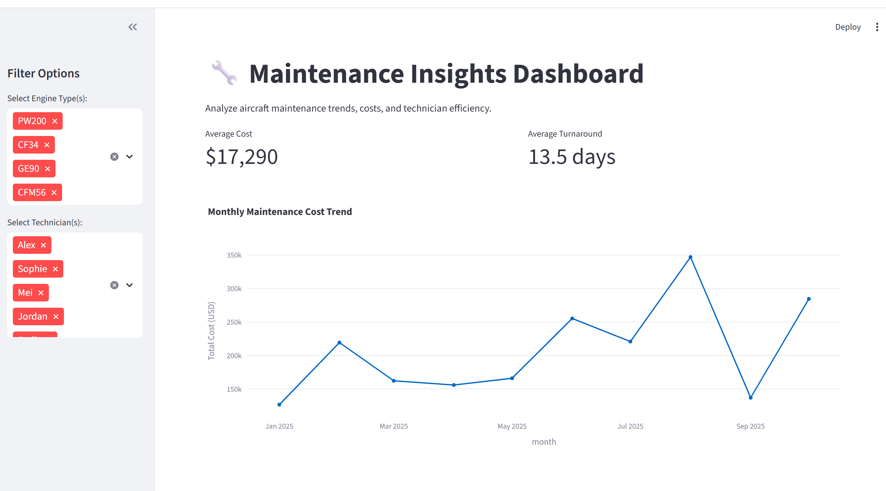
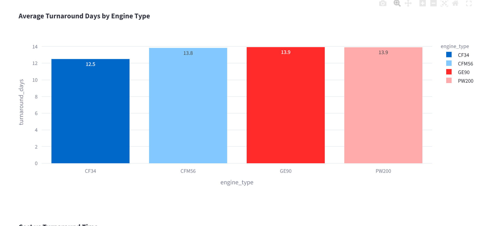
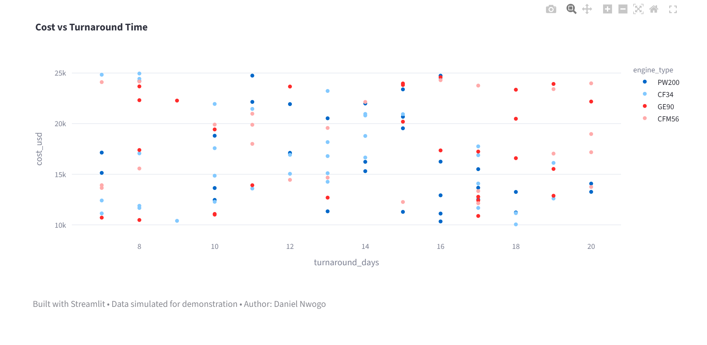

# 🛠️ Maintenance Insights Dashboard

### Author: [Daniel Nwogo](https://www.linkedin.com/in/danielnwogo)

An interactive **data reporting and analytics dashboard** simulating aircraft maintenance operations — inspired by the kind of reporting a data analyst might perform at **StandardAero**.

---

## 🚀 Overview

This project analyzes simulated maintenance job data, focusing on:
- Cost and turnaround time trends.
- Technician and engine type performance.
- Data storytelling through SQL, Python, and Streamlit dashboards.

It demonstrates both **technical analysis** and **business communication skills**, turning data into actionable insights.

---

# Python Dashboard Images

# Streamlit App Images

